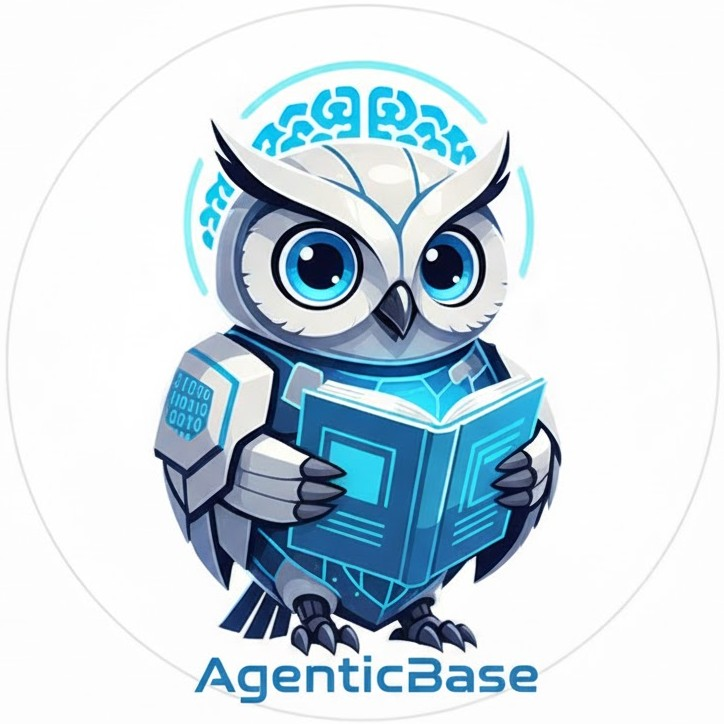

# 🚀 AgenticBase

**Your AI-Powered Personal Agent Hub for Learning, Code Exploration, and Intelligent Automation**

AgenticBase is a cutting-edge full-stack application that combines the power of multiple AI agents to create an intelligent learning and development environment. Built with modern web technologies and powered by Google's Gemini AI, it provides personalized learning experiences, code analysis, and intelligent tutoring.



## ✨ Key Features

### 🧠 **MentorMind - AI-Powered Adaptive Tutor**
- **Personalized Learning Plans**: AI generates structured learning paths for any skill
- **Interactive Quizzing**: 5-question adaptive quizzes with real-time evaluation
- **Intelligent Chat Support**: Get instant help and explanations from AI tutors
- **Progress Tracking**: Monitor your learning journey with detailed analytics
- **Multi-Skill Management**: Learn multiple skills simultaneously

### 🔍 **CodeExplorer - AI Code Analysis** *(Coming Soon)*
- **Intelligent Code Navigation**: AI-powered codebase exploration
- **Automated Code Analysis**: Deep insights into code structure and patterns
- **Smart Debugging**: AI-assisted problem identification and solutions

### 🌐 **NihonAgent - Japanese Learning Assistant** *(Coming Soon)*
- **Language Learning**: Specialized Japanese language tutoring
- **Cultural Context**: Learn Japanese with cultural insights
- **Interactive Practice**: AI-powered conversation practice

## 🛠️ Tech Stack

### **Frontend**
- **React 19** - Modern React with latest features
- **Vite** - Lightning-fast build tool and dev server
- **React Router DOM** - Client-side routing
- **Axios** - HTTP client for API communication
- **CSS3** - Custom styling with modern features

### **Backend**
- **FastAPI** - High-performance Python web framework
- **Google Gemini AI** - Advanced language model integration
- **Pydantic** - Data validation and serialization
- **Uvicorn** - ASGI server for FastAPI

### **AI Agents Architecture**
- **Planning Agent** - Creates structured learning curricula
- **Quiz Agent** - Generates adaptive quiz questions
- **Evaluator Agent** - Provides intelligent answer evaluation
- **Chat Agent** - Offers real-time learning support

### **Development Tools**
- **ESLint** - Code linting and quality assurance
- **Concurrently** - Run multiple development servers
- **Node.js** - JavaScript runtime environment

## 🚀 Quick Start

### Prerequisites
- **Node.js** (v16 or higher)
- **Python** (v3.8 or higher)
- **Google Gemini API Key** ([Get yours here](https://makersuite.google.com/app/apikey))

### Installation

1. **Clone the repository**
   ```bash
   git clone https://github.com/KSahapthan/agentic-base.git
   cd agentic-base
   ```

2. **Install dependencies**
   ```bash
   npm install
   pip install fastapi uvicorn python-dotenv google-genai pydantic
   ```

3. **Set up environment variables**
   Create a `.env` file in the root directory:
   ```env
   GEMINI_PRIMARY_KEY=your_gemini_api_key_here
   ```

4. **Start the application**
   ```bash
   npm run dev
   ```
   This will start both the React frontend (http://localhost:5173) and FastAPI backend (http://localhost:8000)

## 🎯 How to Use

### **Getting Started with MentorMind**

1. **Create Your First Skill**
   - Click "New Skill" button
   - Enter the skill you want to learn (e.g., "Python Programming", "Machine Learning")
   - Provide context about your learning goals and current level
   - AI generates a personalized 10-topic learning plan

2. **Start Learning**
   - Select "Continue Skill" to resume existing learning
   - Click "Want to continue learning" to begin interactive quizzing
   - Answer 5 adaptive questions per subtopic
   - Get instant feedback and explanations

3. **Chat with AI Tutor**
   - Use the left panel to ask questions anytime
   - Get personalized explanations and learning tips
   - AI adapts responses based on your current topic

### **Learning Flow**
```
Select Skill → Generate Plan → Start Learning → Interactive Quiz → 
Get Feedback → Next Question → Complete Subtopic → Next Topic
```

## 🏗️ Architecture

### **Agent-Based Design**
```
┌─────────────────┐    ┌─────────────────┐    ┌─────────────────┐
│   Planning      │    │     Quiz        │    │   Evaluator     │
│    Agent        │    │    Agent        │    │    Agent        │
│                 │    │                 │    │                 │
│ • Creates       │    │ • Generates     │    │ • Evaluates     │
│   curricula     │    │   questions     │    │   answers       │
│ • Structures    │    │ • Adapts        │    │ • Provides      │
│   learning      │    │   difficulty    │    │   feedback      │
└─────────────────┘    └─────────────────┘    └─────────────────┘
         │                       │                       │
         └───────────────────────┼───────────────────────┘
                                 │
                    ┌─────────────────┐
                    │    Chat Agent    │
                    │                 │
                    │ • Real-time     │
                    │   support       │
                    │ • Explanations  │
                    │ • Learning tips │
                    └─────────────────┘
```

### **Data Flow**
1. **User Input** → Planning Agent creates learning structure
2. **Topic Selection** → Quiz Agent generates questions
3. **User Answer** → Evaluator Agent provides feedback
4. **Learning Support** → Chat Agent offers real-time help

## 📁 Project Structure

```
agentic-base/
├── src/
│   ├── backend/
│   │   ├── api_routes/          # FastAPI route handlers
│   │   │   ├── chat_routes.py
│   │   │   ├── quiz_routes.py
│   │   │   ├── evaluator_routes.py
│   │   │   └── planning_routes.py
│   │   ├── MMagents/            # AI Agent implementations
│   │   │   ├── base_agent.py
│   │   │   ├── planning_agent.py
│   │   │   ├── quiz_agent.py
│   │   │   ├── evaluator_agent.py
│   │   │   └── chat_agent.py
│   │   └── mentormind_main.py   # FastAPI application
│   ├── components/              # React components
│   ├── pages/                   # Page components
│   └── assets/                  # Static assets
├── MMagent_learning/            # Learning data storage
└── .env                        # Environment variables
```

## 🔧 API Endpoints

### **Planning Agent**
- `POST /plan/create-skill-plan` - Create new learning plan
- `GET /plan/all-skills` - Get all available skills
- `GET /plan/skill-details/{skill_id}` - Get skill information

### **Quiz Agent**
- `POST /quiz/generate-quiz` - Generate quiz questions
- `POST /quiz/get-question` - Get specific question

### **Evaluator Agent**
- `POST /evaluate/evaluate` - Evaluate user answers

### **Chat Agent**
- `POST /chat/ask` - Get AI tutoring support

## 🎨 UI/UX Features

- **Responsive Design** - Works on desktop, tablet, and mobile
- **Dark/Light Theme** - Beautiful gradient backgrounds
- **Smooth Animations** - Engaging user interactions
- **Hidden Scrollbars** - Clean, minimal interface
- **Auto-resize Textareas** - Dynamic content adaptation
- **Real-time Feedback** - Instant AI responses

## 🚀 Future Roadmap

### **Phase 1 - Core Learning** ✅
- [x] Planning Agent implementation
- [x] Quiz system with evaluation
- [x] Chat support integration
- [x] Multi-skill management

### **Phase 2 - Code Intelligence** 🔄
- [ ] CodeExplorer agent development
- [ ] Codebase analysis features
- [ ] Automated debugging assistance
- [ ] Code quality insights

### **Phase 3 - Language Learning** 📅
- [ ] NihonAgent for Japanese learning
- [ ] Multi-language support
- [ ] Cultural context integration
- [ ] Conversation practice

### **Phase 4 - Advanced Features** 📅
- [ ] Progress analytics dashboard
- [ ] Learning streak tracking
- [ ] Achievement system
- [ ] Social learning features

## 🤝 Contributing

We welcome contributions! Please see our [Contributing Guidelines](CONTRIBUTING.md) for details.

### **Development Setup**
```bash
# Install dependencies
npm install
pip install -r requirements.txt

# Run development servers
npm run dev
```

### **Code Style**
- ESLint for JavaScript/React
- Black for Python formatting
- Type hints for Python functions

## 📄 License

This project is licensed under the MIT License - see the [LICENSE](LICENSE) file for details.

## 👨‍💻 Author

**KSahapthan** - [GitHub](https://github.com/KSahapthan)

## 🙏 Acknowledgments

- **Google Gemini AI** for powerful language model capabilities
- **FastAPI** for the excellent Python web framework
- **React** team for the amazing frontend library
- **Vite** for the lightning-fast build tool

---

**Ready to revolutionize your learning experience?** 🚀

Get started with AgenticBase today and discover the future of AI-powered education!

[](https://github.com/KSahapthan/agentic-base)
[](https://github.com/KSahapthan/agentic-base)
[](https://choosealicense.com/licenses/mit/)