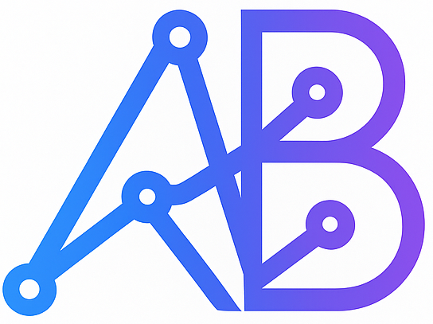
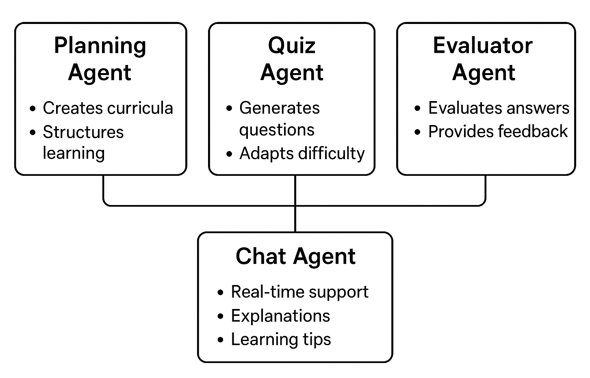

## 📄 About the project : AgenticBase
AgenticBase is a full-stack application that aims to serve as a centralized hub for AI-powered tools, leveraging Large Language Models to enhance developer productivity and learning. The platform currently features MentorMind, an intelligent tutoring system that delivers personalized learning experiences, and will soon introduce CodeExplorer for advanced repository analysis and code understanding

<div align="center" style="display: flex; justify-content: center; align-items: center; gap: 20px;">
  
  
</div>

## ✨ Key Features
### MentorMind — AI-Powered Adaptive Tutor
- **Personalized Learning Paths (Planning Agent):** Automatically generates structured learning plans for any skill or domain  
- **Interactive Quizzing (Quiz Agent):** Adaptive 5-question quizzes with real-time evaluation
- **AI Chat Support (Chat Agent):** Integrated tutor for on-demand explanations and guidance  
- **Progress Tracking (Evaluator Agent):** Persistent JSON-based progress storage.  
- **Multi-Skill Learning:** Seamlessly manage and switch between multiple learning tracks

### CodeExplorer — Intelligent Repo Analysis *(Coming Soon)*
- **Code Navigation**: AI-assisted exploration of codebases for better context and understanding.   
- **AI Debugging**: Identifies potential issues and suggests solutions intelligently

## 🛠️ Tech Stack
### Frontend
<p>
  
  
  
  
  
</p>


### Backend
<p>
  
  
  
  
  
</p>
 
## ⚙️ Installation

**Clone the repository**
   ```bash
   git clone https://github.com/KSahapthan/agentic-base.git
   cd agentic-base
   ```
**Install dependencies**
   ```bash
   npm install
   pip install fastapi uvicorn python-dotenv google-genai pydantic
   ```
**Set up environment variables**
   
   ```env
   # Create a `.env` file in the root directory
   GEMINI_PRIMARY_KEY=your_gemini_api_key_here
   ```
**Start the application**
   ```bash
   npm run dev
   ```
This will start both the React frontend (http://localhost:5173) and FastAPI backend (http://localhost:8000)


## 🏗️ MentorMind Design
<p align="center">
  
</p>

## 📁 Repository Structure

```
agentic-base/
└── .env                        
└── .gitignore
└── index.html
└── public 
├── src/
│   └── main.jsx
│   └── App.jsx
│   └── AppRoutes.jsx
│   ├── assets/                 # Static assets
│   ├── index.css
│   ├── components/             # React components
│   ├── pages/                  # Page components
│   ├── backend/
│   │   ├── api_routes/         # FastAPI route handlers
│   │   │   └── chat_routes.py
│   │   │   └── quiz_routes.py
│   │   │   └── evaluator_routes.py
│   │   │   └── planning_routes.py
│   │   │   └── database_routes.py
│   │   │   └── utils.py
│   │   ├── MMagents/           # MentorMind AI agents
│   │   │   ├── schemas         # Pydantic Schemas for AI output extraction
│   │   │   └── base_agent.py
│   │   │   └── planning_agent.py
│   │   │   └── quiz_agent.py
│   │   │   └── evaluator_agent.py
│   │   │   └── chat_agent.py
│   │   └── mentormind_main.py  # FastAPI backend entry point
```

## 🚀 Ready to get started with AgenticBase?

Explore the project and see how it can help you streamline learning and code exploration

[](https://github.com/KSahapthan/agentic-base)
[](https://github.com/KSahapthan/agentic-base)
